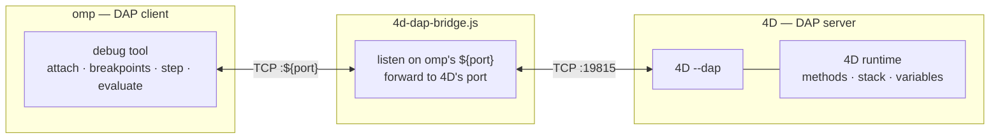

# 4D debug adapter for omp

Debug **4D** code from the [**omp** (oh-my-pi)](https://omp.sh) coding agent using its
built-in [DAP](https://microsoft.github.io/debug-adapter-protocol/) `debug` tool —
set breakpoints, step, evaluate expressions and inspect variables in a running 4D
application.

4D already speaks DAP (`4D --dap`), but its DAP server listens on a **fixed TCP
port** that omp cannot choose, while omp always connects to an adapter on a port
**it** picks. This project bridges the two, and ships a one-command installer so
there are no hard-coded paths to edit.

> Why a bridge is needed (and a proposal to make it unnecessary): see
> [`docs/4D-dap-port-argument-request.md`](docs/4D-dap-port-argument-request.md).

## How it works



omp reserves a free port `P`, spawns the bridge with `P`, waits for it to report
readiness on stdout, then connects. The bridge forwards `P` to 4D's DAP port
(default `19815`), optionally launching 4D headless first.

## Requirements

- **[omp](https://omp.sh)** (oh-my-pi) — its `debug` tool is enabled by default.
- **Node.js** (or Bun) — runs the ~120-line bridge; no dependencies.
- **4D** with DAP support (v20 R8 or later).

## Install

```bash
git clone https://github.com/mesopelagique/omp-4d-dap.git
cd omp-4d-dap
node install.js
```

That copies the bridge and writes `~/.omp/agent/dap.json` with the correct
absolute paths **for your machine** — nothing personal is committed to the repo.

- Install elsewhere: `node install.js --dir /path/to/.omp` (e.g. a project-local
  `.omp/` folder, so the adapter ships with one project).
- Install for another DAP-aware agent: `OMP_AGENT_DIR=~/.claude node install.js`.

## Usage

**1. Start 4D with DAP enabled** (it prints `DAP_READY` and listens on `19815`):

```bash
/Applications/4D.app/Contents/MacOS/4D --project /path/to/MyApp.4DProject --dap --headless
```

**2. Attach from omp** with its `debug` tool:

```
debug  action=attach  adapter=4d  port=19815
```

> Always pass `adapter=4d`. omp's `attach` auto-selects `debugpy` whenever a
> `port` is present, so without it you'd get the wrong adapter.

Then set breakpoints on `.4dm` files, `continue`, `step_*`, `evaluate`, read
`variables` — the full DAP surface.

### Let the bridge launch 4D for you

Set `FOURD_PROJECT` before starting omp; if nothing is listening on the DAP port,
the bridge boots 4D headless on first connect:

```bash
export FOURD_PROJECT=/path/to/MyApp.4DProject
```

(First launch of 4D is heavy — pre-starting it, as in step 1, avoids omp's 30 s
per-request timeout.)

## Configuration

The bridge reads these environment variables (all optional):

| Variable | Default | Purpose |
| --- | --- | --- |
| `FOURD_DAP_HOST` | `127.0.0.1` | Host 4D's DAP server listens on |
| `FOURD_DAP_PORT` | `19815` | Port 4D's DAP server listens on (its publication port) |
| `FOURD_BIN` | `/Applications/4D.app/Contents/MacOS/4D` | Path to the 4D executable (set this on Windows/Linux, or for 4D Server) |
| `FOURD_PROJECT` | *(unset)* | If set, auto-launch this `.4DProject` headless with `--dap` when the DAP port is closed |
| `FOURD_ARGS` | *(unset)* | Extra args appended to 4D on auto-launch |
| `OMP_AGENT_DIR` | `~/.omp/agent` | (installer only) where `dap.json` + the bridge are written |

If your project overrides the publication port, set `FOURD_DAP_PORT` to match.

## Repository layout

```
agent/
  dap.json           adapter definition (installed to ~/.omp/agent/)
  4d-dap-bridge.js   the TCP bridge (Node/Bun, no dependencies)
install.js           one-command installer, fills machine-correct paths
docs/                the "make --dap take a port" feature request for 4D
```

## Uninstall

```bash
rm ~/.omp/agent/dap.json ~/.omp/agent/4d-dap-bridge.js
```

## License

MIT © mesopelagique
