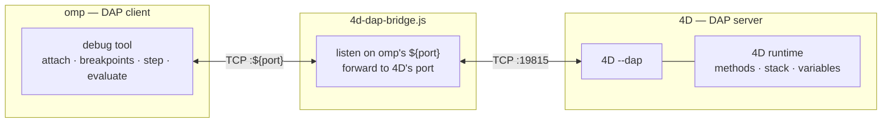

# 4D adapters for omp — debug (DAP) + language (LSP)

Bring **4D** to the [**omp** (oh-my-pi)](https://omp.sh) coding agent:

- **Debug (DAP)** — set breakpoints, step, evaluate, and inspect variables in a
  running 4D application via omp's `debug` tool.
- **Language (LSP)** — completion, hover, go-to-definition, signature help,
  diagnostics and formatting for `.4dm` files, powered by 4D's language server.

Both 4D endpoints use a **TCP** transport that doesn't line up with how omp
connects (omp picks the DAP port; omp speaks LSP over stdio). Each side is glued by
a tiny bridge, and a one-command installer wires both up with no hard-coded paths.

> Why bridges are needed — and proposals to make them unnecessary — are in
> [`docs/`](docs/): a [`--dap` port argument](docs/4D-dap-port-argument-request.md),
> [observable `--dap` failures](docs/4D-dap-observable-when-unsupported.md), and
> [`--lsp=stdio`](docs/4D-lsp-stdio-request.md).

## How DAP works



omp reserves a free port `P`, spawns the bridge with `P`, waits for it to report
readiness on stdout, then connects. The bridge forwards `P` to 4D's DAP port
(default `19815`), optionally launching 4D headless first.

## Requirements

- **[omp](https://omp.sh)** (oh-my-pi) — the `debug` (DAP) and language (LSP) tools
  are on by default.
- **Node.js** (or Bun) — runs the two small bridges; no dependencies.
- **For LSP:** `tool4d` — auto-discovered from the
  [4D-Analyzer](https://github.com/4d/4D-Analyzer-VSCode) VS Code extension, or set
  `TOOL4D_BIN`. Free, no license.
- **For DAP:** **4D Server** with DAP support (**≥ 20 R8**). This is the tested
  target — the official 4D debug tooling connects to "a 4D Server" too. It opens
  your project, prints `DAP_READY`, and listens on `19815`. Single-user `4D.app`
  exposes `--dap` as well, but on some builds it does not open the port — verify
  with the [troubleshooting](#troubleshooting) check below.

> Verified end-to-end on macOS: **DAP** against 4D Server 21.1
> (`initialize`/`attach`/`configurationDone`/`threads`) and **LSP** against
> tool4d 21 R4 (11 providers) — both through the bridges from an omp-style client.

## Install

```bash
git clone https://github.com/mesopelagique/omp-4d-dap.git
cd omp-4d-dap
node install.js
```

That copies both bridges and writes `~/.omp/agent/dap.json` and
`~/.omp/agent/lsp.json` with the correct absolute paths **for your machine** —
nothing personal is committed to the repo.

- Install elsewhere: `node install.js --dir /path/to/.omp` (e.g. a project-local
  `.omp/` folder, so the adapters ship with one project).
- Install for another agent: `OMP_AGENT_DIR=~/.claude node install.js`.

## Language server (LSP)

LSP is the low-friction half — it uses **tool4d** (the free, license-less 4D
command-line tool the [4D-Analyzer](https://github.com/4d/4D-Analyzer-VSCode)
extension already downloads), so there's nothing to license or keep running.

Once installed, omp auto-detects the `4d` language server for `.4dm` files in any
project with a `.4DProject` (or `Project/` folder) — **no manual start needed**.
You get completion, hover, go-to-definition, signature help, diagnostics and
formatting.

- tool4d is **auto-discovered** from the 4D-Analyzer extension's install (newest
  version). If you don't use that extension, point `TOOL4D_BIN` at a `tool4d`
  executable.
- 4D's `--lsp=<port>` is a *reverse* connection (tool4d dials back to a port omp's
  bridge opens), so `4d-lsp-bridge.js` relays omp's stdio to that socket. tool4d
  loads the project from the LSP workspace omp sends — no `--project` needed.

> Verified end-to-end against **tool4d 21 R4**: `initialize` returns the full 4D
> language surface (11 providers) through the bridge.

## Debugging (DAP)

**1. Start 4D Server with DAP enabled** — it opens the project with its data,
prints `DAP_READY`, and listens on `19815` (adjust the path to your installed
version):

```bash
"/Applications/4D Server.app/Contents/MacOS/4D Server" --project "/path/to/MyApp.4DProject" --dap
```

Wait for the `DAP_READY` line before attaching. (Debugging runs against the real
data file, so you can step through the actual application.) If the project has no
data file yet, add `--create-data` the first time so 4D creates one:

```bash
"/Applications/4D Server.app/Contents/MacOS/4D Server" --project "/path/to/MyApp.4DProject" --dap --create-data
```

**2. Attach from omp** with its `debug` tool:

```
debug  action=attach  adapter=4d  port=19815
```

> Always pass `adapter=4d`. omp's `attach` auto-selects `debugpy` whenever a
> `port` is present, so without it you'd get the wrong adapter.

Then set breakpoints on `.4dm` files, `continue`, `step_*`, `evaluate`, read
`variables` — the full DAP surface.

### Let the bridge launch 4D for you

Set `FOURD_PROJECT` before starting omp; if nothing is listening on the DAP port,
the bridge boots 4D headless on first connect:

```bash
export FOURD_PROJECT="/path/to/MyApp.4DProject"
export FOURD_BIN="/Applications/4D Server.app/Contents/MacOS/4D Server"   # 4D Server, not single-user 4D
```

(First launch of 4D is heavy — pre-starting it, as in step 1, avoids omp's 30 s
per-request timeout.)

## Configuration

The bridges read these environment variables (all optional).

**DAP bridge** (`4d-dap-bridge.js`):

| Variable | Default | Purpose |
| --- | --- | --- |
| `FOURD_DAP_HOST` | `127.0.0.1` | Host 4D's DAP server listens on |
| `FOURD_DAP_PORT` | `19815` | Port 4D's DAP server listens on (its publication port) |
| `FOURD_BIN` | `/Applications/4D Server.app/Contents/MacOS/4D Server` | Path to **4D Server** (single-user 4D is not supported); set for a versioned install (e.g. `/Applications/4D 21.1/...`) or on Windows/Linux |
| `FOURD_PROJECT` | *(unset)* | If set, auto-launch this `.4DProject` headless with `--dap` when the DAP port is closed |
| `FOURD_ARGS` | *(unset)* | Extra args appended to 4D on auto-launch |

**LSP bridge** (`4d-lsp-bridge.js`):

| Variable | Default | Purpose |
| --- | --- | --- |
| `TOOL4D_BIN` | *(auto-discovered)* | Path to a `tool4d` executable; overrides discovery from the 4D-Analyzer extension |
| `TOOL4D_ARGS` | *(unset)* | Extra args appended to tool4d |

`OMP_AGENT_DIR` (default `~/.omp/agent`) tells the **installer** where to write
`dap.json`, `lsp.json`, and the two bridges. If your project overrides the DAP
publication port, set `FOURD_DAP_PORT` to match.

## Repository layout

```
agent/
  dap.json           DAP adapter definition   (installed to ~/.omp/agent/)
  4d-dap-bridge.js   DAP TCP bridge           (Node/Bun, no dependencies)
  lsp.json           LSP server definition    (installed to ~/.omp/agent/)
  4d-lsp-bridge.js   LSP stdio<->reverse-TCP bridge to tool4d
install.js           one-command installer, fills machine-correct paths
docs/                feature requests for 4D (--dap port arg; observable --dap; --lsp=stdio)
```

## Troubleshooting

**`attach` hangs, or the bridge reports "4D DAP not reachable".** First confirm 4D
actually opened the DAP port:

```bash
lsof -nP -iTCP:19815 -sTCP:LISTEN
```

- **No output** → 4D isn't exposing DAP. This is a 4D-side issue, not the bridge.
  Use a DAP-capable 4D Server build — a real one prints `DAP_READY` on stdout, so
  `strings "<4D binary>" | grep DAP_READY` should find it.
- **A `LISTEN` line** → 4D is fine; check `adapter=4d` was passed and the ports
  match (`FOURD_DAP_PORT` if your project uses a non-default publication port).

**Wrong adapter picked.** omp's `attach` prefers `debugpy` when a `port` is set —
always pass `adapter=4d` explicitly.

**LSP does nothing / "tool4d not found".** The bridge auto-discovers tool4d from
the 4D-Analyzer VS Code extension; if you don't have it, set `TOOL4D_BIN` to a
`tool4d` executable. LSP only activates in a project with a `.4DProject` (or
`Project/` folder) — omp matches those root markers before starting the server.

## Uninstall

```bash
rm ~/.omp/agent/{dap.json,4d-dap-bridge.js,lsp.json,4d-lsp-bridge.js}
```

## License

MIT © mesopelagique
