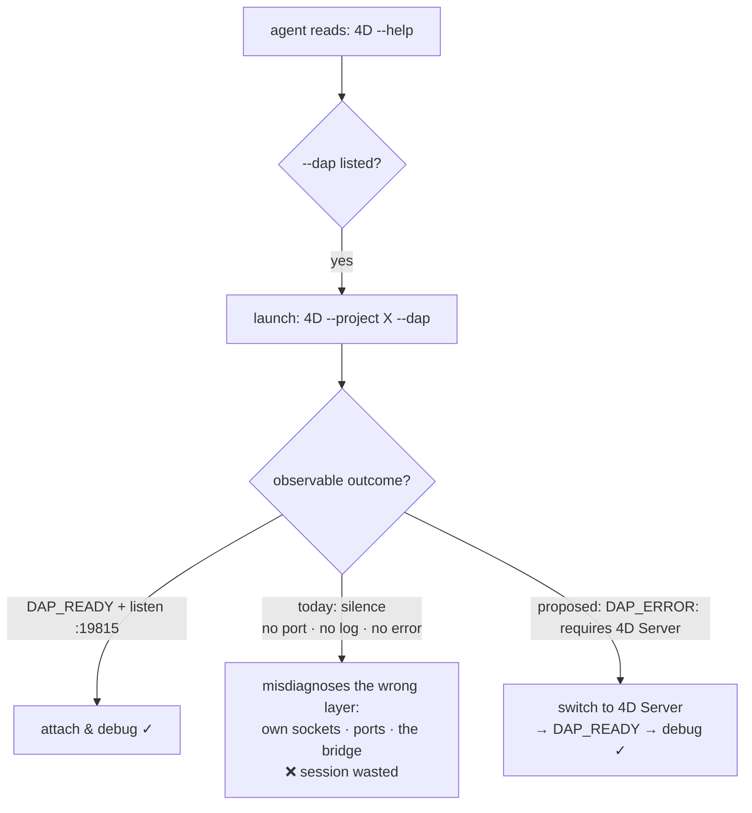

# Feature request: make an unsupported `--dap` observable (don't fail silently)

## The ask

When `4D --dap` cannot start a Debug Adapter Protocol server, make the failure
**observable** — do one or both of:

1. **Hide the flag when unsupported** — don't advertise `--dap` in `--help` on
   builds/editions that can't run it.
2. **Diagnose at runtime** *(recommended)* — keep `--dap` in `--help`, but when the
   server can't start, write a clear reason to the **diagnostic log** and to
   **stdout**, mirroring the existing `DAP_READY` marker, e.g. `DAP_ERROR: …`.

Best: always do (2); optionally also (1).

## What happens today

`4D --help` lists:

```
--dap   Launch the Debugger Adapter Protocol server
```

But on **single-user 4D** (observed on build `0.0 build 0.300166`), launching with
`--dap` **silently does nothing**:

- never binds TCP `19815` (`lsof` on the process shows **no listening socket**);
- never prints `DAP_READY`;
- writes **nothing** about DAP to the diagnostic log;
- returns **no error** and a normal exit code.

Tried with `--headless`, `--dataless`, `--skip-onstartup`, and `--create-data` —
same silence every time. The `DAP_READY` marker string is **absent from the entire
app bundle**, so this build simply has no working DAP server, yet still offers the
flag.

For contrast, **4D Server 21.1** with `--dap` prints `DAP_READY` and listens on
`19815` immediately. So the very same flag is fully supported in one edition and a
silent no-op in another — with **no way to tell them apart from the outside**.

## Why it matters

- **Silent failure is the worst failure.** With nothing in the log, no marker, and
  no exit code, you cannot distinguish "this build doesn't support DAP" from "my
  debugger client is misconfigured." You debug the wrong layer.
- **AI / agent debugging.** Coding agents (omp, Claude, and similar) discover
  capabilities by reading `--help`, then launch and **observe stdout/logs**. A flag
  that appears in help but emits no signal is a trap: the agent assumes success and
  spends its budget investigating its own sockets, ports, and adapter code instead
  of the real cause. We hit exactly this — an agent burned a long session probing
  ports and flag combinations because 4D said nothing. A single line —
  `DAP_ERROR: requires 4D Server` — would have let it pivot in seconds.
- **Human developer experience.** Same benefit for anyone following the 4D VS Code
  debugger docs and wondering why "Attach" hangs.
- **Consistency.** 4D already prints `DAP_READY` on success. A matching failure
  marker closes the loop and is trivial to act on.

## How an agent experiences it



The only difference between the two bad-vs-good branches is **one line of output**.

## Proposed behavior

### Option A — hide the flag when unsupported
`--help` omits `--dap` on editions/builds without DAP; `4D --dap` there returns a
usage error (`unknown option: --dap`). Discoverable, but loses the "why".

### Option B — diagnose at runtime *(recommended)*
Keep `--dap` in `--help`. When the server cannot start, emit a clear reason to
**both** the diagnostic log and stdout (symmetric with `DAP_READY`), then exit
non-zero (or continue without DAP). For example:

```
DAP_ERROR: Debug Adapter Protocol requires 4D Server (this is single-user 4D)
DAP_ERROR: Debug Adapter Protocol is not available in this build
DAP_ERROR: Debug Adapter Protocol failed to bind port 19815: <reason>
```

A short, stable reason token (e.g. `DAP_ERROR: unsupported-edition`) lets tools
branch on it programmatically.

## Backward compatibility

Purely additive. The success path (`DAP_READY` + a listening socket) is unchanged;
this only adds a signal on the failure path (Option B) and/or trims `--help`
(Option A). Nothing that works today breaks.

## Summary

Turn a silently-ignored flag into a one-line diagnostic. It costs almost nothing to
emit and saves both humans and automated agents from debugging the wrong layer.

---

*Filed against: `4D --dap` on editions/builds without a working DAP server.
Observed: single-user 4D `0.0 build 0.300166` (flag advertised, no port, no log, no
`DAP_READY`) vs 4D Server 21.1 (works, prints `DAP_READY`, listens on `19815`).
See also [`4D-dap-port-argument-request.md`](4D-dap-port-argument-request.md).*
