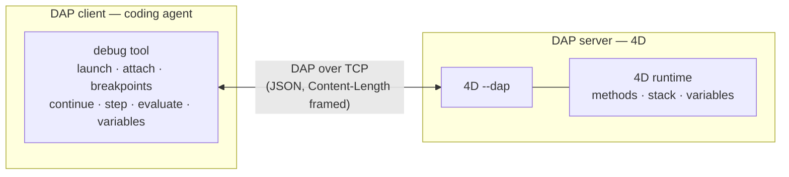
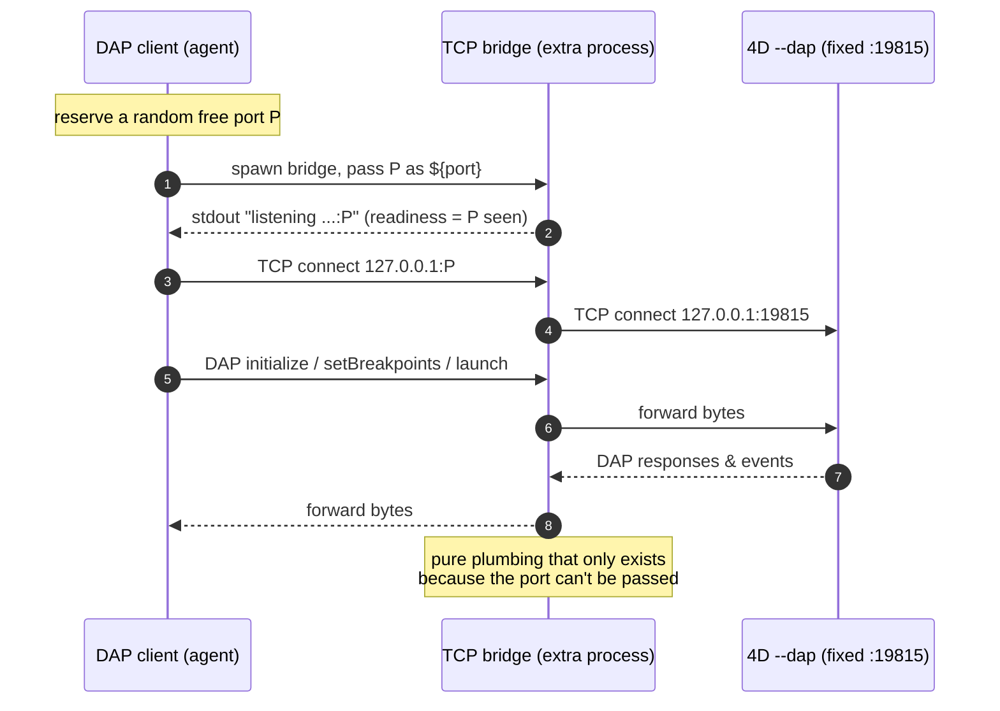
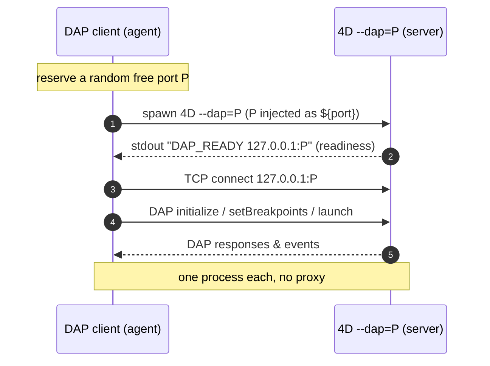

# Feature request: let `--dap` accept an optional port, like `--lsp=PORT`

## The ask

Allow the `--dap` command-line option to take an **optional** port value, exactly the way `--lsp` already does:

```
--dap[=[host:]port]
```

- `--dap` (no value) → **unchanged**: bind the DAP server to today's port (the application/server publication port, default `19815`).
- `--dap=PORT` → bind the DAP server to `PORT` on loopback.
- `--dap=HOST:PORT` → bind to a specific interface (opt-in; default stays loopback).
- `--dap=0` → bind an **OS-assigned free port** and announce it on stdout (see [Readiness banner](#bonus-dap0-auto-port--readiness-banner)).

This is purely **additive** and fully backward compatible.

## Current behavior

From `4D --help`:

```
--lsp=VALUE   Language server protocol port
--dap         Launch the Debugger Adapter Protocol server
```

`--lsp` takes a port. `--dap` is a boolean flag — the DAP server always binds the
4D **publication port** (default `19815`), which can only be changed in the
project settings (`publication_port`), never on the command line.

This is visible in 4D's own tooling: the official
[`4d/4D-Debugger-VSCode`](https://github.com/4d/4D-Debugger-VSCode) extension
hard-codes `kPortNumber = 19815`, spawns `4D --project <path> --dap`, waits for a
`DAP_READY` line on stdout, then opens a TCP DAP connection to that fixed port.

## Why the fixed port hurts

1. **One machine, one debuggable instance.** Two projects (or two runtimes of the
   same project — interpreted vs compiled, a CI matrix, parallel test shards)
   cannot both expose DAP without editing each project's `publication_port`. A CLI
   override is the natural fix.
2. **Port collisions have no escape hatch.** If `19815` is already in use
   (another 4D, another service, a leftover process), there is no way to say
   "use a different one" from the launch command.
3. **Impedance mismatch with modern DAP clients.** Editors and coding agents that
   speak DAP follow a well-established pattern: **the client reserves a free
   ephemeral port and hands it to the debug server**, then connects to it. Every
   mainstream adapter supports this (see [Precedent](#precedent-every-major-dap-server-takes-a-port)).
   Because `--dap` cannot receive a port, these clients must insert a **TCP bridge
   / proxy** between themselves and 4D — an extra process, an extra failure mode,
   extra latency, and a worse first-run experience.
4. **Inconsistency between the two sibling protocols.** `--lsp` takes a port;
   `--dap` does not. They are the two halves of the same editor-integration story;
   the asymmetry is surprising and undocumented.

## How DAP works with a coding agent

A DAP **client** (here, a coding agent's debug tool exposing ~28 DAP operations)
talks to a DAP **server/adapter** (here, `4D --dap`) over a stream — for 4D, a
**TCP socket** carrying `Content-Length`-framed JSON. The server drives the real
4D runtime: it sets breakpoints, steps, and reads variables.



The only open question is **how the client and the `4D --dap` server agree on the
TCP port**. That single detail is what this request is about.

### Today — a bridge is required (because the port is fixed)

The agent's `tcp` transport reserves a **random** free port `P`, substitutes it
into the adapter command as `${port}`, spawns the adapter, waits for `P` to appear
on the adapter's stdout, then connects to `P`. 4D can't be told to use `P`, so a
bridge has to sit in the middle and forward `P → 19815`:



### Proposed — direct, no bridge

With `--dap=PORT`, the agent injects its reserved port straight into the 4D
command. The bridge disappears entirely:



## Precedent — every major DAP server takes a port

| Debug adapter | How the client sets the port |
| --- | --- |
| `lldb-dap` / `codelldb` | `--port <n>` (`--port 0` = auto-assign) |
| `vscode-js-debug` (`dapDebugServer.js`) | positional `<port>` argument |
| Delve (`dlv dap`) | `--listen=host:<n>` |
| `debugpy` | `--port <n>` |
| **4D today** | *(none — fixed publication port)* |
| **4D proposed** | `--dap=<n>` |

4D would simply join the norm its own siblings already follow.

## Backward compatibility

- Bare `--dap` keeps its exact current meaning (publication port / `19815`).
- Existing `4D-Debugger-VSCode` launch configs keep working untouched.
- The change is strictly opt-in: nothing breaks if the value is never supplied.

## Bonus: `--dap=0` auto-port + readiness banner

The most tool-friendly variant is **`--dap=0`** → let the OS pick a free port,
then print the resolved address so the caller can read it back. 4D already emits a
`DAP_READY` marker on stdout; extending it to include the bound address, e.g.

```
DAP_READY 127.0.0.1:52344
```

would let any client discover the port with zero configuration — the exact model
`vscode-js-debug` and `codelldb --port 0` use. This eliminates *both* the fixed
port *and* the need for the caller to pre-pick one.

## Summary

Make `--dap` mirror `--lsp`: `--dap[=[host:]port]`, defaulting to today's behavior.
It removes an entire class of proxy/bridge workarounds, unlocks concurrent debug
sessions and container scenarios, and makes the two editor-integration protocols
consistent — all with zero breakage.

---

*Filed against: `4D --dap` (Debugger Adapter Protocol server). References: `4D --help`;
[`4d/4D-Debugger-VSCode`](https://github.com/4d/4D-Debugger-VSCode) `editor/src/extension.ts`
(`kPortNumber = 19815`, spawns `4D … --dap`, connects TCP);
[Debug Adapter Protocol](https://microsoft.github.io/debug-adapter-protocol/).*
