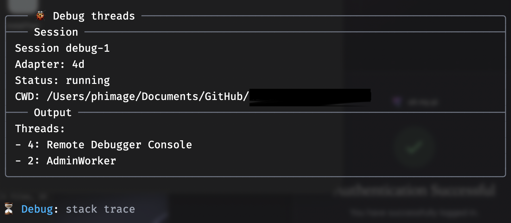
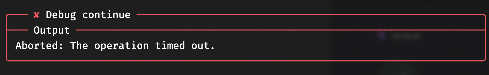
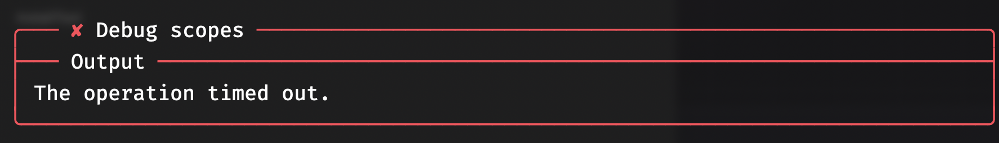

# 4D Server DAP — supported operations (evaluated)

Which Debug Adapter Protocol operations actually work when driving **4D Server**
`--dap` through the omp `debug` tool + the `4d` bridge adapter. Every row below was
**exercised firsthand**, not read from a spec.

- **Target:** `4D Server.app 21.1 --project <X> --dap --headless`, listening on TCP
  `19815`, prints `DAP_READY`.
- **Client:** omp `debug` device → `4d` adapter (`~/.omp/agent/dap.json`) → TCP
  bridge (`~/.omp/agent/4d-dap-bridge.js`) → `127.0.0.1:19815`.
- Single-user **4D.app does not work** for `--dap` (silent no-op); use 4D Server.

## Support matrix

| Operation            | Works? | Notes |
|----------------------|:------:|-------|
| `attach` (port)      | ✅ | Requires `port:19815` (+`host`). `attach` without a pid/port errors. |
| `set_breakpoint`     | ✅ | By `file`+`line`; returns `verified`. |
| `remove_breakpoint`  | ✅ | Echoes remaining breakpoints. |
| `threads`            | ✅ | Fast, reliable even mid-run. Shows `AdminWorker` + `Remote Debugger Console`. |
| `continue`           | ✅¹ | Stops at next breakpoint. With **no** further breakpoint → times out (see §Gotchas). |
| `step_over`          | ✅ | Advances one line; returns new stop frame. |
| `stack_trace`        | ✅² | Works **only** when a thread is stopped; hangs otherwise. |
| `evaluate` (`watch`) | ✅ | **The way to read state.** Returns value + 4D type in a stopped frame. |
| `evaluate` (`repl`)  | ⚠️ | Runs code (used to *launch* a method) but **returns no value** — always `Result:` empty. |
| `terminate`          | ✅ | Ends the debug session cleanly. |
| `scopes`             | ❌ | Times out. Use `evaluate`(`watch`) on named vars instead. |
| `pause`              | ❌ | Times out; cannot interrupt a free-running debuggee. |
| `variables`          | ❌ | Depends on `scopes`; not usable. |
| `terminated` event   | ❌ | 4D Server never emits one → normal completion looks like a timeout. |

¹ `continue` between two breakpoints is reliable.
² `stack_trace` is the stopped/running litmus: responds ⇒ stopped, hangs ⇒ running/finished.

## Screenshots

`threads` responds reliably even mid-run — the stopped/running probe of choice:



`continue` past the last breakpoint runs off the end; with no `terminated` event
the client reports a timeout — this *is* normal completion, not a failure:



`scopes` is unsupported and simply times out — read state with `evaluate`(`watch`)
instead:



## `evaluate` — the primary inspection tool

Because `scopes`/`variables` don't work, **all state inspection goes through
`evaluate` with `context:"watch"` while stopped at a breakpoint.** It returns both
the value and the 4D datatype.

```jsonc
// read an object variable as JSON
{"action":"evaluate","expression":"JSON Stringify($v)","context":"watch"}
//   → Result: "{\"success\":true,\"errors\":[]}"  Type: Texte

// read a boolean
{"action":"evaluate","expression":"$v.success","context":"watch"}
//   → Result: Vrai   Type: Booléen
```

- Any valid 4D expression works: property access, `JSON Stringify(...)`, method
  calls, ORDA (`ds._Students`, `cs.Phrase.new(...).validate(...)`), etc.
- Types come back **localized** (`Texte`, `Booléen`, `Réel`, `Objet`…).
- `context:"hover"` behaves like `watch`; `context:"repl"` **executes but discards
  the value** — use it to *trigger* work, not to read it.

### Launching a method to debug
There's no "launch program" path here — you *attach* to a live server, then kick
off code with a repl evaluate:

```jsonc
{"action":"evaluate","expression":"test_phrase","context":"repl"}
```

This spawns a `Remote Debugger Console` thread that runs the method and honors your
breakpoints.

## Gotchas

- **No `terminated` event.** After the last breakpoint, `continue` runs off the end
  and the client **times out** — that timeout *is* the success signal, not a fault.
  Keep a breakpoint on the final line if you need a clean stop to inspect from.
- **`stack_trace`/`pause`/`scopes` hang when nothing is stopped.** Poll `threads`
  (cheap) to check liveness; only call `stack_trace` after you expect a stop.
- **Set breakpoints before triggering.** Add every checkpoint, *then* repl-evaluate
  the method, then `continue`/`step_over` between stops.
- **`attach` needs the port.** `{"action":"attach","adapter":"4d","port":19815}`.

## Minimal working recipe

```jsonc
// 1. start server (outside omp debug):
//    4D Server --project <X> --dap --headless   → waits for DAP_READY / :19815
// 2. attach
{"action":"attach","adapter":"4d","port":19815,"host":"127.0.0.1"}
// 3. breakpoints (add all up front)
{"action":"set_breakpoint","file":".../Methods/test_phrase.4dm","line":93}
// 4. trigger the method
{"action":"evaluate","expression":"test_phrase","context":"repl"}
// 5. confirm stop, inspect, advance
{"action":"stack_trace","levels":3}
{"action":"step_over"}
{"action":"evaluate","expression":"JSON Stringify($v)","context":"watch"}
{"action":"continue"}          // stops at next breakpoint (or times out = done)
// 6. clean up
{"action":"remove_breakpoint","file":"...","line":93}
{"action":"terminate"}
```

## Worked example — `test_phrase`

Verified `Methods/test_phrase.4dm` (unit tests for `cs.Phrase`) end-to-end on 4D
Server via the flow above:

- Breakpoints at lines **12 / 93 / 211**, triggered with `evaluate("test_phrase")`.
- **12 → 93** via `continue`: all render/dot-notation tests (12–91) passed, no error stop.
- Line **93** `validate(ds._Students)` stepped over → `{"success":true,"errors":[]}`
  (this is the exact ORDA call that fails under `tool4d --dataless` with
  `[-10716] Object or Collection Expected` — a dataless-runtime limitation, not a
  test bug).
- **93 → 211** via `continue`: every `validate` assertion (94–210) held.
- Line **211**: `$v.success = Vrai`.
- Breakpoints removed; final `continue` ran off the end (timeout = clean finish).

**Result: `test_phrase` passes on 4D Server.**

---

*Observed: 4D Server 21.1 `--dap` on `127.0.0.1:19815`, driven by omp `debug` +
the `4d` bridge adapter. See also
[`4D-dap-observable-when-unsupported.md`](4D-dap-observable-when-unsupported.md)
and [`4D-dap-port-argument-request.md`](4D-dap-port-argument-request.md).*
