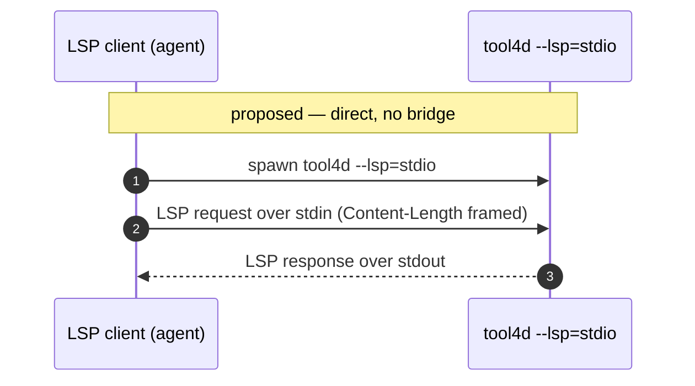

# Feature request: LSP over stdio (`--lsp=stdio`) so no bridge is needed

## The ask

Let 4D's language server speak LSP over **stdio** — its own stdin/stdout — in
addition to the current port mode:

```
tool4d --lsp=stdio        # or: --lsp with no value ⇒ stdio
tool4d --lsp=<port>       # unchanged (reverse TCP, see below)
```

With stdio, any editor or agent could spawn `tool4d --lsp=stdio` and talk to it
directly. No listener, no reverse socket, no port — **no bridge**.

## What happens today

`--lsp=VALUE` takes a **port**, and the connection is *reversed*: the **client**
opens a TCP server and 4D **dials back** into it. From the official
[4D-Analyzer](https://github.com/4d/4D-Analyzer-VSCode) extension
(`editor/src/managers/LanguageServerManager.ts`):

```js
// Use a TCP socket because of problems with blocking STDIO
const server = net.createServer(socket => {
    resolve({ reader: socket, writer: socket, detached: false });
});
server.listen(port, '127.0.0.1', () => {
    child_process.spawn(serverPath, ['--lsp=' + server.address().port]);
});
```

So integrating 4D LSP into any **stdio-based** client (the default model for LSP)
requires reproducing that dance: open a loopback listener, spawn `tool4d --lsp=P`,
wait for it to connect back, and relay bytes between the client's stdio and that
socket. That relay is exactly the `4d-lsp-bridge.js` in this repo — pure plumbing
that exists only because stdio isn't offered.

## Why stdio

- **It's the LSP default.** The overwhelming majority of language servers speak
  stdio out of the box — rust-analyzer, clangd, gopls, pyright,
  typescript-language-server, lua-language-server — and the overwhelming majority
  of clients (VS Code, Neovim, Helix, Zed, and coding agents such as
  [omp](https://omp.sh)) spawn servers over stdio by default. 4D is the outlier
  that needs a custom socket handshake.
- **Fewer moving parts.** No listener, no port selection, no reverse-connect race,
  no bridge process to install and keep in sync — just `spawn` + two pipes.
- **Sandbox / container friendly.** No loopback TCP socket to open or firewall;
  stdio crosses process and container boundaries cleanly.
- **Consistency.** It pairs with the `--dap` requests in this folder: make the
  transports match what the tooling ecosystem actually expects.

## Today vs proposed

```mermaid
sequenceDiagram
    autonumber
    participant C as LSP client (agent)
    participant B as stdio↔TCP bridge
    participant T as tool4d --lsp=P
    Note over C,B: today — a bridge is required
    C->>B: spawn bridge; speak LSP over its stdio
    B->>B: open loopback listener on port P
    B->>T: spawn tool4d --lsp=P
    T-->>B: dial back to :P (reverse connect)
    C->>B: LSP request (stdio)
    B->>T: relay over socket
    T-->>B: LSP response
    B-->>C: relay to stdout
```



The bridge — and the whole reverse-socket handshake — simply disappears.

## The "blocking STDIO" note

The extension comment (*"problems with blocking STDIO"*) suggests an earlier
implementation hit blocking-I/O issues on the pipes. That's a solvable
implementation detail, not a protocol limit: LSP over stdio is fully specified
(`Content-Length`-framed JSON-RPC), and dozens of servers implement it reliably
with non-blocking reads or a dedicated I/O thread. The ask is to finish that path
and expose it — not to remove the port mode.

## Backward compatibility

Purely additive. `--lsp=<port>` and today's reverse-TCP behavior stay exactly as
they are; this only adds `--lsp=stdio` (and/or bare `--lsp` ⇒ stdio) as an
alternative transport. Nothing that works today breaks.

## Summary

Offer LSP over stdio. It's what nearly every LSP client and server already use,
it deletes an entire bridge and its reverse-socket handshake, and it costs only an
alternative transport alongside the port mode that stays untouched.

---

*Filed against: `4D --lsp` / `tool4d --lsp`. Observed: `--lsp=<port>` reverse-TCP
(4D-Analyzer `LanguageServerManager.ts`) vs the stdio default used by most LSP
tooling. See also [`4D-dap-port-argument-request.md`](4D-dap-port-argument-request.md)
and [`4D-dap-observable-when-unsupported.md`](4D-dap-observable-when-unsupported.md).*
